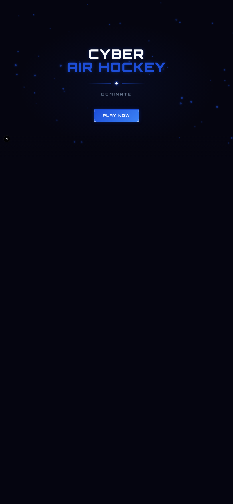
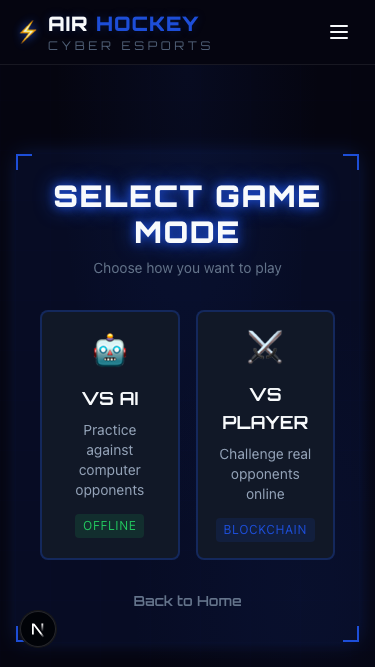
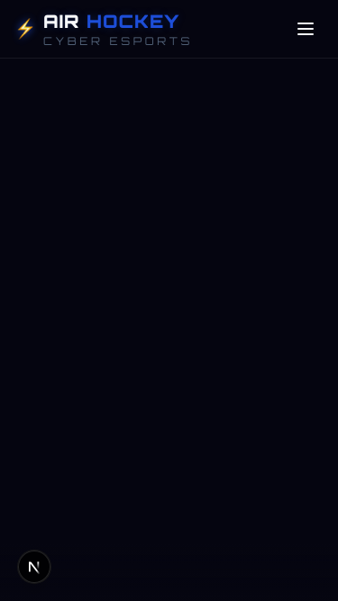

# Cyber Air Hockey: Real-time multiplayer on Base

A Farcaster Mini App where you play air hockey against AI or friends, with on-chain match results on Base Sepolia.

[](https://www.typescriptlang.org/)
[](https://nextjs.org/)
[](https://soliditylang.org/)
[](LICENSE)
[]()



## Live Demo

**[air-hockey-base.vercel.app](https://air-hockey-base.vercel.app)**

Open in Warpcast to play as a Farcaster Mini App.

---

## What Is Cyber Air Hockey?

A neon-themed air hockey game built for Farcaster. Play solo against three AI difficulty levels or challenge a friend in real-time multiplayer. Match results are recorded on Base Sepolia, and the whole thing runs inside Warpcast as a Mini App.

---

## Screenshots

| Game Mode Selection | Landing |
|---------------------|---------|
|  |  |

---

## Features

- **AI Opponents**: Three difficulty levels (easy, medium, hard) with configurable score limits
- **Real-time Multiplayer**: Server-authoritative physics at 60Hz, WebSocket sync at 30Hz
- **On-chain Results**: Match scores recorded on Base Sepolia via smart contract
- **Farcaster Native**: Runs as a Mini App inside Warpcast with user context detection
- **Wallet Integration**: RainbowKit + wagmi for Base network wallet connection
- **Reconnection Handling**: 5-second grace period for dropped connections mid-game
- **Rematch System**: Request and accept rematches without leaving the game screen
- **Audio System**: Background music, sound effects, countdown beeps, victory fanfares

---

## Tech Stack

| Layer | Technology |
|-------|-----------|
| Frontend | Next.js 16, React 19, TypeScript |
| Styling | TailwindCSS 4, Framer Motion, GSAP |
| Physics | Matter.js (client + server) |
| State | Zustand |
| Server | Node.js, Express, ws (WebSocket) |
| Blockchain | Solidity 0.8.20, Hardhat, Base Sepolia |
| Wallet | RainbowKit, wagmi, viem |
| Platform | Farcaster MiniApp SDK |
| Audio | Howler.js |

---

## How to Play

**AI Mode**
1. Open the app and tap "Play"
2. Select "VS AI"
3. Pick a difficulty and score limit
4. Drag your paddle to block and strike the puck

**Multiplayer**
1. Tap "VS Player"
2. Create a game (generates a room code)
3. Share the code with a friend
4. Both players ready up, then a 3-2-1 countdown starts
5. First to the score limit wins. Results go on-chain.

---

## How It Works

```
Player A ---|                         |--- Physics Engine (60Hz)
            |---> WebSocket Server <--|--- Room Manager
Player B ---|     (Railway)           |--- Game State Broadcaster (30Hz)
                      |
                      v
              Express REST API
                      |
                      v
            Base Sepolia Contract
            (match results on-chain)
```

**AI Mode**: Client runs Matter.js physics locally. No server needed.

**Multiplayer**: Server owns all game state. Clients send paddle positions, server runs physics and broadcasts state 30 times per second. Prevents cheating and ensures consistency.

---

## Smart Contracts

| Contract | Network | Description |
|----------|---------|-------------|
| AirHockey.sol | Base Sepolia | Game creation, joining, result recording, player stats |

Key functions:
- `createGame(roomCode)` - Start a new match
- `joinGame(gameId)` - Join an existing match
- `submitResult(gameId, p1Score, p2Score)` - Oracle submits final scores
- `getPlayerStats(address)` - View wins/losses/games played

---

## API Reference

| Method | Endpoint | Description |
|--------|----------|-------------|
| GET | `/api/health` | Health check |
| POST | `/api/games` | Create new game |
| GET | `/api/games` | List open games |
| GET | `/api/games/:id` | Get game by ID or room code |
| POST | `/api/games/:id/join` | Join existing game |
| POST | `/api/games/:id/result` | Submit final score |
| POST | `/api/games/:id/cancel` | Cancel waiting game |

---

## Running Locally

### Prerequisites
- Node.js 18+
- A wallet with Base Sepolia test ETH ([faucet](https://www.coinbase.com/faucets/base-ethereum-goerli-faucet))

### 1. Clone and install

```bash
git clone https://github.com/dmustapha/air-hockey-base.git
cd air-hockey-base
npm install
cd server && npm install && cd ..
cd contracts && npm install && cd ..
```

### 2. Set environment variables

```bash
cp .env.example .env.local
```

Fill in:
- `NEXT_PUBLIC_WS_URL=ws://localhost:3001/ws`
- `NEXT_PUBLIC_API_URL=http://localhost:3001`
- `NEXT_PUBLIC_CONTRACT_ADDRESS=` (deploy contract first)
- `NEXT_PUBLIC_WALLETCONNECT_PROJECT_ID=` (from cloud.walletconnect.com)

### 3. Deploy contract (optional)

```bash
cd contracts
echo "DEPLOYER_PRIVATE_KEY=your-private-key" > .env
npx hardhat run scripts/deploy.ts --network baseSepolia
```

### 4. Start the server

```bash
cd server && npm run dev
```

### 5. Start the frontend

```bash
npm run dev
```

Open [http://localhost:3000](http://localhost:3000).

---

## Project Structure

```
air-hockey-base/
├── src/
│   ├── app/                  # Next.js App Router pages
│   │   ├── (cyber)/          # Game routes (home, game, profile, leaderboard, settings)
│   │   ├── api/farcaster/    # Webhook endpoint
│   │   └── .well-known/      # Farcaster Mini App manifest
│   ├── components/
│   │   ├── game/             # Canvas renderer
│   │   ├── cyber/            # Themed UI (game screens, home sections, menus)
│   │   └── ui/               # Reusable components
│   ├── hooks/                # Game engine, WebSocket, input, wallet hooks
│   ├── stores/               # Zustand stores (game, player, settings, achievements)
│   ├── lib/
│   │   ├── physics/          # Matter.js engine, config, collision bodies
│   │   ├── farcaster/        # SDK wrapper and user context
│   │   └── wagmi/            # Wallet config (RainbowKit + Base)
│   └── types/                # TypeScript interfaces
├── server/
│   ├── src/
│   │   ├── index.ts          # Express + WebSocket entry
│   │   ├── physics/          # Server-side Matter.js engine
│   │   ├── websocket/        # Room manager, message handlers
│   │   └── services/         # Game logic orchestration
│   └── Dockerfile            # Railway deployment
├── contracts/
│   ├── contracts/AirHockey.sol
│   ├── scripts/deploy.ts
│   └── test/                 # 46 passing tests
└── public/                   # Static assets (icons, audio)
```

---

## License

MIT
